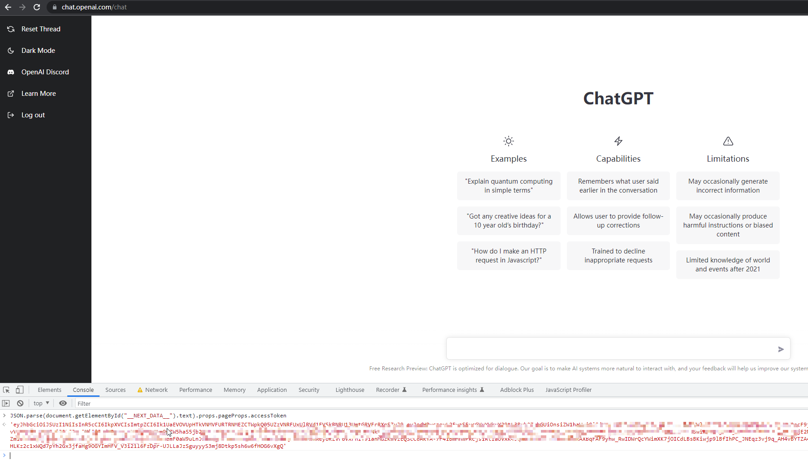

# ChatGPT API  For Golang 

# 一、这是什么

这是一个ChatGPT的Golang API库，让你能够把ChatGPT集成到你的Go应用中，注意这是基于逆向工程实现的并不是一个官方库。

优势：

- 只需要提供自己的JWT就能够像在网页上使用一样在Go程序中使用ChatGPT，很方便的就可以把ChatGPT集成到您开发的各种Go应用中 

- 会话维持，ChatGPT是可以保持部分上下文的（这一点上比智障小爱同学强多了...），对于这一点本API库提供了支持，比如：

  - ```
    我：你好，我的名字叫陈二！
    ChatGPT: 你好，陈二！很高兴认识你。我是 Assistant，一个大型语言模型，旨在帮助人们了解更多关于世界的信息。如果你有什么问题，我将尽力回答。
    我：我的名字叫什么呀？
    ChatGPT：你告诉我你的名字叫陈二。你的名字是一个很普通的中国姓氏和名字，在中国文化中，许多人都有一个姓氏和一个名字。例如，陈是一个常见的姓氏，而二是一个常见的名字。不过，每个人的名字都是独一无二的，所以你的名字只属于你自己。
    ```

    甚至在你的JWT次数用尽之后可以换一个JWT继续维持会话。
  
  - 发生错误之后更友好的提示信息，默认情况下发生错误时返回的是一个HTML页面，本库进行了错误信息抽取，将其转为更友好的文本信息 

# 二、安装

```bash
go get -u github.com/golang-infrastructure/go-ChatGPT
```

# 三、如何使用

## 3.1 如何获取ChatGPT的JWT？

首先你要注册成功一个openapi的账号（教程此处不提供，请自行Google），并且能够在网页上正常使用ChatGPT，然后在ChatGPT的聊天页面，地址是这个：

```
https://chat.openai.com/chat
```

按F12打开控制台，粘贴如下代码，即可看到自己的JWT Token：

```js
JSON.parse(document.getElementById("__NEXT_DATA__").text).props.pageProps.accessToken
```

如图：



## 3.2 API代码示例

```go
package main

import (
	"fmt"
	chatgpt "github.com/golang-infrastructure/go-ChatGPT"
)

func main() {

	// 把JWT放到这里
	jwt := "xxx"

	chat := chatgpt.NewChatGPT(jwt)
	talk, err := chat.Talk("你好，我的名字叫陈二！")
	if err != nil {
		fmt.Println(err.Error())
		return
	}
	fmt.Println(talk.Message.Content)

	talk, err = chat.Talk("我的名字叫什么呀？")
	if err != nil {
		fmt.Println(err.Error())
		return
	}
	fmt.Println(talk.Message.Content)

	// Output:
	// {text [你好，陈二！很高兴认识你。我是 Assistant，一个大型语言模型，旨在帮助人们了解更多关于世界的信息。如果你有什么问题，我将尽力回答。]}
	// {text [你告诉我你的名字叫陈二。你的名字是一个很普通的中国姓氏和名字，在中国文化中，许多人都有一个姓氏和一个名字。例如，陈是一个常见的姓氏，而二是一个常见的名字。不过，每个人的名字都是独一无二的，所以你的名字只属于你自己。]}

}

```


